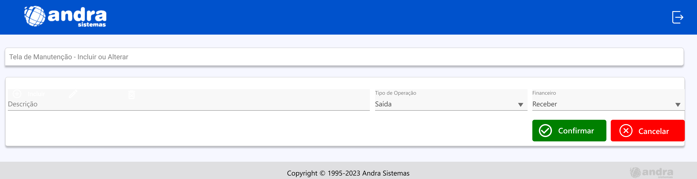

<h1 align="center">Andra</h1>



## 🔧 Como executar o projeto

Na raiz do projeto, execute:
```bash
   yarn install
   ```
Em seguida:
```bash
   yarn dev
   ```
O projeto estará rodando no endereço http://localhost:3000.